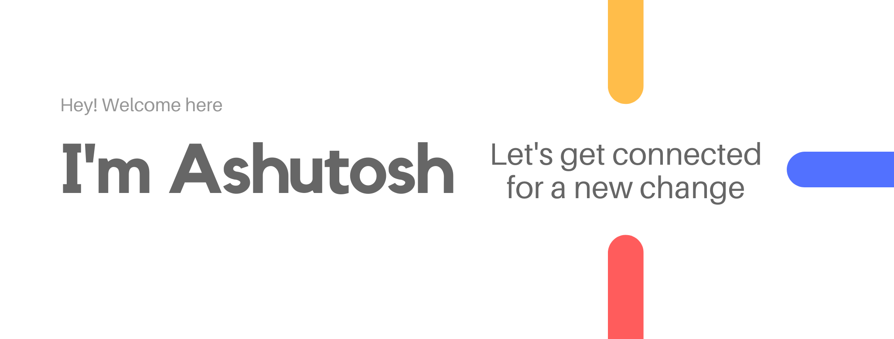

### Hi there 👋
## I am Ashutosh
- 🔭 I’m currently working as a **Front-end developer**.
- 🌱 I’m currently learning **React JS** and seriously, I'm just loving it 💙
- 👯 I’m looking to collaborate on Front-end projects or Web appliations.
- 💬 I'll love to discuss about your new ideas and creations, just drop a message.
- 📫 You can always reach me via [LinkedIn](https://www.linkedin.com/in/ashutoshbisoyi/) or [Email](mailto:ashutoshbisoyi205@gmail.com)
- ⚡ Fun fact: I am a **Chocolates Lover**, Send me some before we start our discussion on a new project

## About Me
Hey, I am Ashutosh, currently pursuing my bachelor's degree focused in Elcenctronics and Communication Engineering from [GIET University](https://www.giet.edu/). Along with studies, I'm working as a Front-end developer. I have a serious passion for exploring new ideas and formatting them digitally as a website. I'm pretty familiar with developing interactive front-end websites, building single-page applications, and API integrations.

I have worked with multiple organizations and start-ups and helped them to showcase their story/services by building website that is pretty efficient and more approachable. 15+ realtime websites done till now and still upgrading to new technologies with the trend.

Besides developing web pages, I am quite passionate about dancing, anchoring, and acting.

## Weapons I use

       

## Let's get connected

